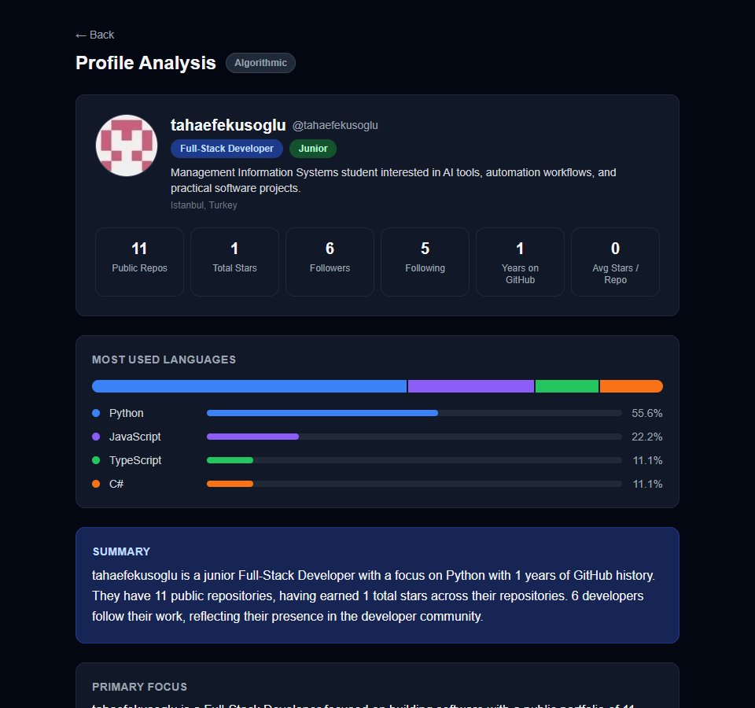
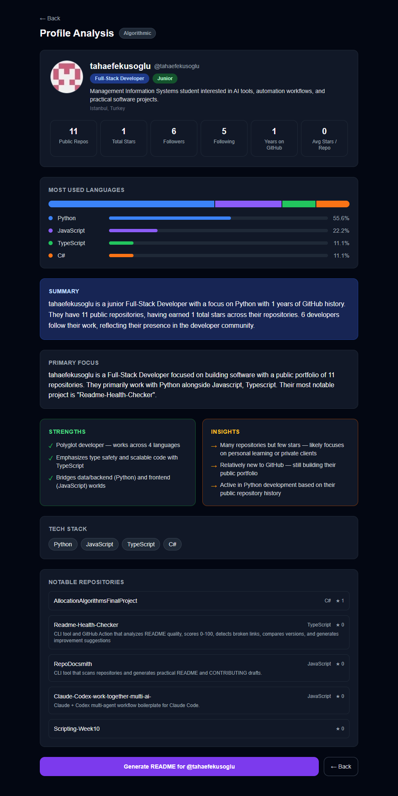
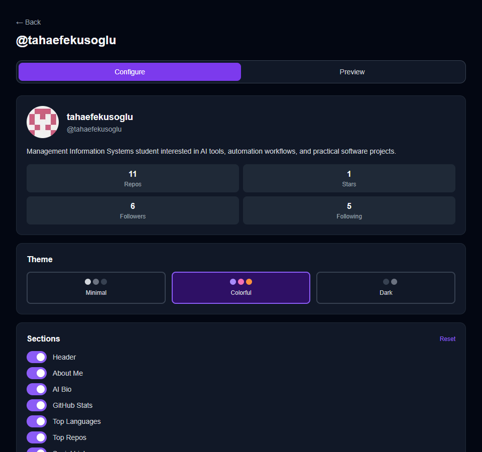

# GitHub Profile README Generator

A full-stack web application with two tools: a **GitHub profile README generator** and a **developer profile analyzer**. Enter any GitHub username or profile URL — no account, no login required.


---

## Screenshots

### Landing Page


### Profile Analyzer




### README Generator


---

## What It Does

### Tool 1 — README Generator

Generates a ready-to-paste `README.md` for your GitHub profile page.

- Pulls real data directly from the GitHub API (repos, stars, languages)
- 3 visual themes: **Minimal**, **Colorful**, **Dark**
- 7 toggleable sections: Header, About Me, AI Bio, GitHub Stats, Top Languages, Top Repos, Social Links
- Optional AI-written bio (2-3 sentences, specific to your actual work)
- Live markdown preview with one-click copy

### Tool 2 — Profile Analyzer

Gives a structured breakdown of any developer's GitHub profile.

- **Developer type** — Full-Stack, Backend, iOS, Data Scientist, DevOps, etc.
- **Experience level** — Junior / Mid-level / Senior / Expert
- **Primary focus** — what they mainly work on
- **Strengths** — up to 5 specific data-backed points
- **Insights** — observations about activity, reputation, language use
- **Tech stack** — detected technologies
- **Language breakdown** — stacked bar + percentage bars per language
- **Top repositories** — stars, description, language, clickable links
- **Stats cards** — public repos, total stars, followers, following, years on GitHub, avg stars/repo

Works without any API key — AI gives richer descriptions, but the analysis never breaks.

---

## Tech Stack

| Layer | Technology |
|---|---|
| Backend | ASP.NET Core 8 Web API |
| Frontend | Next.js 14 App Router + Tailwind CSS + TypeScript |
| AI (optional) | Claude 3.5 Sonnet · GPT-4o mini · Gemini 1.5 Flash |
| Data | GitHub REST API v3 |
| Caching | ASP.NET Core IMemoryCache |
| Rate limiting | Built-in ASP.NET Core sliding window (20 req/min per IP) |
| Resilience | Microsoft.Extensions.Http.Resilience — 3 retries, 500ms backoff |

---

## Project Structure

```
github-readme-generator/
├── backend/
│   └── GitHubReadmeGenerator.API/
│       ├── Controllers/
│       │   ├── GitHubController.cs       GET /api/github/{username}
│       │   ├── BioController.cs          POST /api/bio/generate
│       │   ├── ReadmeController.cs       POST /api/readme/generate
│       │   └── AnalysisController.cs     GET /api/analysis/{username}
│       ├── Services/
│       │   ├── IAiService.cs             AI provider interface
│       │   ├── ClaudeService.cs          Anthropic Claude
│       │   ├── OpenAiService.cs          OpenAI GPT-4o mini
│       │   ├── GeminiService.cs          Google Gemini 1.5 Flash
│       │   ├── LocalProfileAnalyzer.cs   Algorithmic fallback (no key needed)
│       │   ├── AiProviderFactory.cs      Picks active provider from config
│       │   ├── GitHubService.cs          GitHub API client + caching
│       │   └── ReadmeTemplateService.cs  Markdown template engine
│       ├── Models/
│       │   ├── GitHubProfile.cs
│       │   ├── ProfileAnalysis.cs
│       │   ├── ReadmeConfig.cs
│       │   └── ApiResponse.cs
│       ├── Dockerfile
│       ├── railway.json
│       ├── appsettings.json
│       └── appsettings.Development.json  ← API keys here (gitignored)
│
├── frontend/
│   ├── app/
│   │   ├── page.tsx                      Landing page — choose tool
│   │   ├── generate/[username]/page.tsx  README generator
│   │   └── analyze/[username]/page.tsx   Profile analyzer
│   ├── components/
│   │   ├── ProfileCard.tsx
│   │   ├── ThemeSelector.tsx
│   │   ├── SectionToggle.tsx
│   │   ├── ReadmePreview.tsx
│   │   └── CopyButton.tsx
│   └── lib/
│       ├── api.ts      Backend API calls
│       └── types.ts    TypeScript interfaces
│
└── .github/
    └── workflows/ci.yml   Build checks on every push
```

---

## Prerequisites

| Tool | Minimum version | Download |
|---|---|---|
| .NET SDK | 8.x | [dotnet.microsoft.com](https://dotnet.microsoft.com/download/dotnet/8.0) |
| Node.js | 18.x | [nodejs.org](https://nodejs.org) |

Verify installation:
```bash
dotnet --version   # should print 8.x.x
node --version     # should print v18.x or higher
```

---

## Local Setup

### 1. Get the code

```bash
git clone https://github.com/YOUR_USERNAME/github-readme-generator.git
cd github-readme-generator
```

### 2. Add API keys (optional)

Open `backend/GitHubReadmeGenerator.API/appsettings.Development.json`:

```json
{
  "GitHub": {
    "Token": ""
  },
  "Anthropic": {
    "ApiKey": ""
  },
  "OpenAI": {
    "ApiKey": ""
  },
  "Gemini": {
    "ApiKey": ""
  }
}
```

All fields are optional — leave them empty to run without AI features.

### 3. Start the backend

```bash
cd backend/GitHubReadmeGenerator.API
dotnet run
```

When you see `Now listening on: http://0.0.0.0:8080` the backend is ready.

### 4. Start the frontend

Open a second terminal:

```bash
cd frontend
npm install      # first time only
npm run dev
```

Open [http://localhost:3000](http://localhost:3000).

---

## Environment Variables

### Backend

Set in `appsettings.Development.json` for local dev, or as OS environment variables for production.

| Variable | Config key | Default | Purpose |
|---|---|---|---|
| `GITHUB_TOKEN` | `GitHub:Token` | none | Rate limit 60 → 5,000 req/hr |
| `ANTHROPIC_API_KEY` | `Anthropic:ApiKey` | none | Enables Claude |
| `OPENAI_API_KEY` | `OpenAI:ApiKey` | none | Enables GPT-4o mini |
| `GEMINI_API_KEY` | `Gemini:ApiKey` | none | Enables Gemini 1.5 Flash |
| `ALLOWED_ORIGINS` | `AllowedOrigins` | `http://localhost:3000` | CORS allowed origins |
| `PORT` | — | `8080` | Listening port |

### Frontend

| Variable | Default | Purpose |
|---|---|---|
| `NEXT_PUBLIC_API_URL` | `http://localhost:8080` | Backend base URL |

---

## AI Provider Selection

The backend automatically picks the first configured provider:

```
1. Anthropic API key set?  →  Claude 3.5 Sonnet
2. OpenAI API key set?     →  GPT-4o mini
3. Gemini API key set?     →  Gemini 1.5 Flash
4. None configured?        →  LocalProfileAnalyzer (always works)
```

The profile analysis page shows which provider was used:

| Badge | Color | Meaning |
|---|---|---|
| `✨ Claude` | Violet | Anthropic Claude |
| `✨ GPT-4o` | Green | OpenAI GPT-4o mini |
| `✨ Gemini` | Blue | Google Gemini |
| `Algorithmic` | Gray | No API key — rule-based analysis |

---

## Algorithmic Analysis (No API Key)

When no AI provider is configured, `LocalProfileAnalyzer` generates the analysis from raw GitHub data:

**Developer type detection** looks at language distribution:
- Swift/Objective-C primary → iOS Developer
- Dart present → Flutter / Mobile Developer
- Python primary, no JS → Python / Data Developer
- R, Julia, MATLAB → Data Scientist
- Rust/Zig, no web languages → Systems Engineer
- Shell/HCL only → DevOps Engineer
- JS/TS + Python/Java/Go → Full-Stack Developer

**Experience level** is a weighted score:

| Signal | Points |
|---|---|
| 10+ years on GitHub | 4 |
| 1,000+ total stars | 4 |
| 500+ followers | 3 |
| 80+ public repos | 3 |
| 7–9 years | 3 |
| 300–999 stars | 3 |
| ... | ... |

Score ≥ 10 → Expert · ≥ 6 → Senior · ≥ 3 → Mid-level · else → Junior

---

## API Reference

All responses use `{ "success": bool, "data": T, "error": string }`.

### `GET /api/health`
```json
{ "status": "ok" }
```

### `GET /api/github/{username}`
Returns GitHub profile with repos and language stats.

| Status | Meaning |
|---|---|
| 200 | Profile data |
| 400 | Invalid username format |
| 404 | User not found |
| 429 | GitHub rate limit hit |

Profile data is cached 5 minutes. Not-found is cached 2 minutes.

### `POST /api/bio/generate`
Body: `GitHubProfile` object (same shape as GET response `data` field)

Returns a 2-3 sentence plain-text bio string.

| Status | Meaning |
|---|---|
| 200 | Bio text |
| 503 | No AI provider configured |

### `POST /api/readme/generate`
```json
{
  "username": "torvalds",
  "theme": "colorful",
  "enabledSections": ["header", "about", "stats", "languages", "top_repos"],
  "aiBio": null,
  "profile": { }
}
```

Valid themes: `minimal` · `colorful` · `dark`

Valid sections: `header` · `about` · `ai_bio` · `stats` · `languages` · `top_repos` · `socials`

### `GET /api/analysis/{username}`
Returns a `ProfileAnalysis` object. Never returns 503 — falls back to algorithmic analysis if no AI key is set.

---

## README Themes

| Section | Minimal | Colorful | Dark |
|---|---|---|---|
| Stats card | `default` | `radical` | `dark` |
| Language card | `default` | `radical` | `dark` |

The README uses [github-readme-stats](https://github.com/anuradhaCodes/github-readme-stats) cards embedded as image URLs. They render automatically when the README is displayed on GitHub.

---

## Deployment

### Backend → Railway

The repo includes `backend/railway.json` and `backend/GitHubReadmeGenerator.API/Dockerfile`.

1. Push the repo to GitHub
2. railway.app → New Project → Deploy from GitHub repo
3. Set environment variables in the Railway dashboard:
   - `ALLOWED_ORIGINS` = your Vercel frontend URL
   - `ANTHROPIC_API_KEY` / `OPENAI_API_KEY` / `GEMINI_API_KEY` (any one is enough)
   - `GITHUB_TOKEN` (recommended)
4. Railway builds from the Dockerfile automatically

### Frontend → Vercel

1. vercel.com → New Project → Import from GitHub
2. Set **Root Directory** to `frontend`
3. Add environment variable: `NEXT_PUBLIC_API_URL` = your Railway backend URL
4. Deploy

---

## Architecture

```
Browser
  │
  ▼
Next.js 14 — Vercel
  │
  │  REST (JSON)
  ▼
ASP.NET Core 8 — Railway
  ├──► GitHub REST API v3    (profile data, repos, languages)
  └──► AI Provider (optional)
         ├── Claude 3.5 Sonnet  (Anthropic)
         ├── GPT-4o mini        (OpenAI)
         ├── Gemini 1.5 Flash   (Google)
         └── LocalProfileAnalyzer (no external call)
```

---

## Security

- API keys are never committed — `appsettings.Development.json` is gitignored
- Production secrets are set only via environment variables
- All username inputs are validated against `^[a-zA-Z0-9\-]{1,39}$`
- CORS is restricted to configured origins only
- Request body size is capped at 100KB
- Rate limiting (20 req/min per IP) protects all write and AI endpoints

---

## License

MIT
