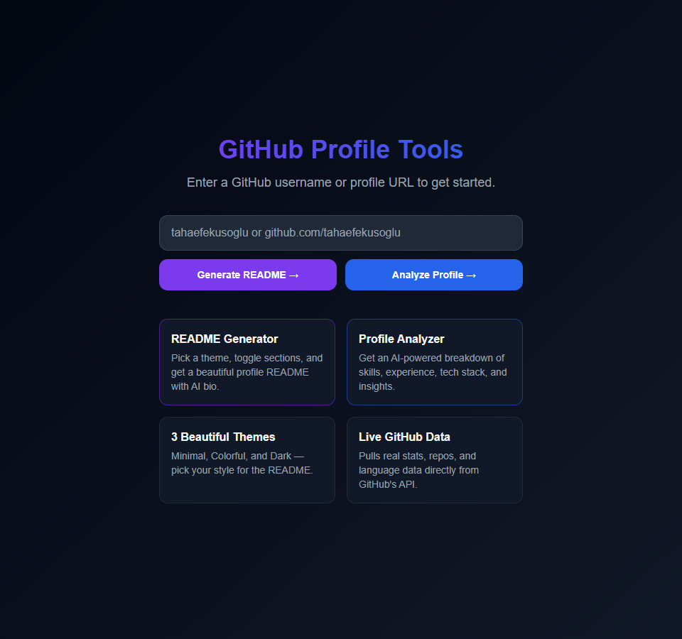

# GitHub Profile Insights & README Generator

A full-stack web application with two tools: analyze any GitHub developer profile with AI-powered insights, and generate a beautiful profile README — from just a username or URL. No account required.

---

## Screenshot



---

## Features

### Tool 1 — Profile Insights

Enter any GitHub username and get a structured analysis of their developer profile.

- **Developer type** — automatically detected (Full-Stack, Backend, iOS, Data Scientist, DevOps, Systems, etc.)
- **Experience level** — Junior / Mid-level / Senior / Expert, scored from real data
- **Stats dashboard** — public repos, total stars, followers, following, years on GitHub, avg stars/repo
- **Language breakdown** — stacked bar + individual percentage bars per language
- **Strengths & insights** — data-backed observations on activity, reputation, specialization
- **Notable repositories** — top repos with stars, language, description, links
- **Per-request AI provider & model** — choose Claude / OpenAI / Gemini per analysis; type any model ID (e.g. `claude-opus-4-6`, `gpt-4.5`) or leave blank to use the default
- **Works without any API key** — built-in `LocalProfileAnalyzer` runs rule-based analysis when no AI key is set

### Tool 2 — README Generator

- **3 themes** — Minimal, Colorful, Dark
- **7 toggleable sections** — Header, About Me, AI Bio, GitHub Stats, Top Languages, Top Repos, Social Links
- **Optional AI bio** — choose provider + model per request; leave model blank to use the default
- **Live preview + one-click copy**

---

## How It Works

Backend fetches GitHub profile data (repos, stars, languages), then routes to Profile Insights (AI or algorithmic analysis) or the README Generator (template engine). Enter a username or full GitHub URL — both work.

---

## Tech Stack

| Layer | Technology |
|---|---|
| Backend | ASP.NET Core 8 Web API |
| Frontend | Next.js 14 + TypeScript + Tailwind CSS |
| AI | Claude 3.5 Sonnet · GPT-4o mini · Gemini 1.5 Flash · LocalProfileAnalyzer (fallback) |
| Data | GitHub REST API v3 |
| Caching | IMemoryCache — 5 min profiles, 2 min 404s |
| Rate limiting | Sliding window — 20 req/min per IP |
| Hosting | Railway (backend) · Vercel (frontend) |

---

## Project Structure

```
github-profile-insights/
├── backend/GitHubReadmeGenerator.API/
│   ├── Controllers/   # GitHubController, AnalysisController, BioController, ReadmeController
│   ├── Services/      # IAiService, Claude/OpenAi/GeminiService, LocalProfileAnalyzer, GitHubService, ReadmeTemplateService
│   ├── Models/        # GitHubProfile, ProfileAnalysis, ReadmeConfig, ...
│   ├── Dockerfile
│   └── railway.json
├── frontend/
│   ├── app/           # page.tsx, analyze/[username], generate/[username]
│   ├── components/
│   └── lib/           # api.ts, types.ts
├── docs/screenshots/
└── .github/workflows/ci.yml
```

---

## Prerequisites

Install [.NET SDK 8.x](https://dotnet.microsoft.com/download/dotnet/8.0) and [Node.js 18.x](https://nodejs.org). Verify with `dotnet --version` and `node --version`.

---

## Running Locally

**1. Clone**
```bash
git clone https://github.com/tahaefekusoglu/github-profile-insights.git
cd github-profile-insights
```

**2. Configure API keys (optional)**

Create `backend/GitHubReadmeGenerator.API/appsettings.Development.json`:
```json
{
  "GitHub":    { "Token": "" },
  "Anthropic": { "ApiKey": "" },
  "OpenAI":    { "ApiKey": "" },
  "Gemini":    { "ApiKey": "" }
}
```

> All fields optional. Without keys: analysis runs in Algorithmic mode, README Generator works fully, AI Bio button returns an error.
>
> Keys: [GitHub Token](https://github.com/settings/tokens) · [Anthropic](https://console.anthropic.com) · [OpenAI](https://platform.openai.com/api-keys) · [Gemini](https://aistudio.google.com/app/apikey)

**3. Start the backend** (Terminal 1)
```bash
cd backend/GitHubReadmeGenerator.API
dotnet run
# → Now listening on: http://0.0.0.0:8080
```

**4. Start the frontend** (Terminal 2)
```bash
cd frontend
npm install   # first run only
npm run dev
# → Local: http://localhost:3000
```

**5.** Open [http://localhost:3000](http://localhost:3000) and enter any GitHub username or URL.

To stop: `Ctrl + C` in each terminal. To restart: same commands, skip `npm install`.

---

## Environment Variables

| Variable | Default | Purpose |
|---|---|---|
| `GITHUB_TOKEN` | — | Raises GitHub API rate limit from 60 to 5,000 req/hr |
| `ANTHROPIC_API_KEY` | — | Enables Claude 3.5 Sonnet |
| `OPENAI_API_KEY` | — | Enables GPT-4o mini |
| `GEMINI_API_KEY` | — | Enables Gemini 1.5 Flash |
| `ALLOWED_ORIGINS` | `http://localhost:3000` | Comma-separated CORS origins |
| `PORT` | `8080` | Backend listening port |
| `NEXT_PUBLIC_API_URL` | `http://localhost:8080` | Frontend → backend URL |

Configure locally in `appsettings.Development.json`, or as environment variables in production.

---

## AI Provider Selection

Each request can specify a provider and model independently. The frontend shows a dropdown of configured providers (only those with an API key set) and a free-text model input — leave it blank to use the default.

| Provider | Default model | Notes |
|---|---|---|
| Claude | `claude-3-5-sonnet-20241022` | Best quality |
| OpenAI | `gpt-4o-mini` | Fast, cheap |
| Gemini | `gemini-1.5-flash` | Free tier available |
| Algorithmic | — | Always works, no cost |

Type any model ID to override the default (e.g. `claude-opus-4-6`, `gpt-4.5`, `gemini-2.0-flash-exp`). The badge on the analysis page shows which provider was used.

---

## Algorithmic Analysis

When no API key is set, `LocalProfileAnalyzer.cs` generates the full analysis from GitHub data alone:

- **Developer type** — inferred from language distribution (Swift → iOS, Rust+no-web → Systems Engineer, JS/TS+backend → Full-Stack, etc.)
- **Experience level** — weighted score from years on GitHub, total stars, repos, and followers → Junior / Mid-level / Senior / Expert
- **Strengths & insights** — pattern-matched from repo count, star distribution, language diversity, and community signals

---

## API Reference

All endpoints return: `{ "success": boolean, "data": T, "error": string }`

**`GET /api/health`** — Returns `{ "status": "ok" }`.

**`GET /api/ai/providers`** — Returns the list of AI providers that have an API key configured. Used by the frontend to populate the provider dropdown.

**`GET /api/github/{username}`** — Fetches profile, repos, stars, languages. Cached 5 min (404s: 2 min). Returns 400 for invalid usernames, 404 if not found, 429 on rate limit.

**`GET /api/analysis/{username}?provider=claude&model=claude-opus-4-6`** — Returns a full `ProfileAnalysis` object. `provider` and `model` are optional; omit both for algorithmic fallback. Never returns 503.

```json
{
  "username": "torvalds",
  "developerType": "Systems Engineer",
  "experienceLevel": "Expert",
  "primaryFocus": "...",
  "strengths": ["..."],
  "insights": ["..."],
  "techStack": ["C", "Shell", "Python"],
  "summary": "...",
  "isAiGenerated": false,
  "aiProvider": null,
  "stats": { "publicRepos": 10, "totalStars": 250, "followers": 230000, "following": 0, "yearsOnGitHub": 14, "languages": [...], "topRepos": [...] }
}
```

**`POST /api/bio/generate?provider=openai&model=gpt-4.5`** — Generates an AI-written bio. Body: `GitHubProfile` object. `provider` and `model` optional — omit to auto-select first configured provider. Returns 503 if no AI provider is configured.

**`POST /api/readme/generate`** — Generates README markdown. Body: `{ username, theme, enabledSections, aiBio, profile }`. Valid themes: `minimal` · `colorful` · `dark`. Valid sections: `header` · `about` · `ai_bio` · `stats` · `languages` · `top_repos` · `socials`.

---

## Deployment

**Backend → Railway:** Repo includes `Dockerfile` and `railway.json`. Go to [railway.app](https://railway.app) → New Project → Deploy from GitHub. Add variables: `ALLOWED_ORIGINS` (your Vercel URL), `GITHUB_TOKEN`, and optionally one AI key.

**Frontend → Vercel:** Go to [vercel.com](https://vercel.com) → New Project → Import repo. Set Root Directory to `frontend`. Add `NEXT_PUBLIC_API_URL` = your Railway URL.

---

## Security

- API keys never committed — `appsettings.Development.json` is gitignored
- Production secrets set only via environment variables
- Usernames validated against `^[a-zA-Z0-9\-]{1,39}$` before any external call
- CORS locked to configured origins; rate limited at 20 req/min per IP

---

## License

MIT
